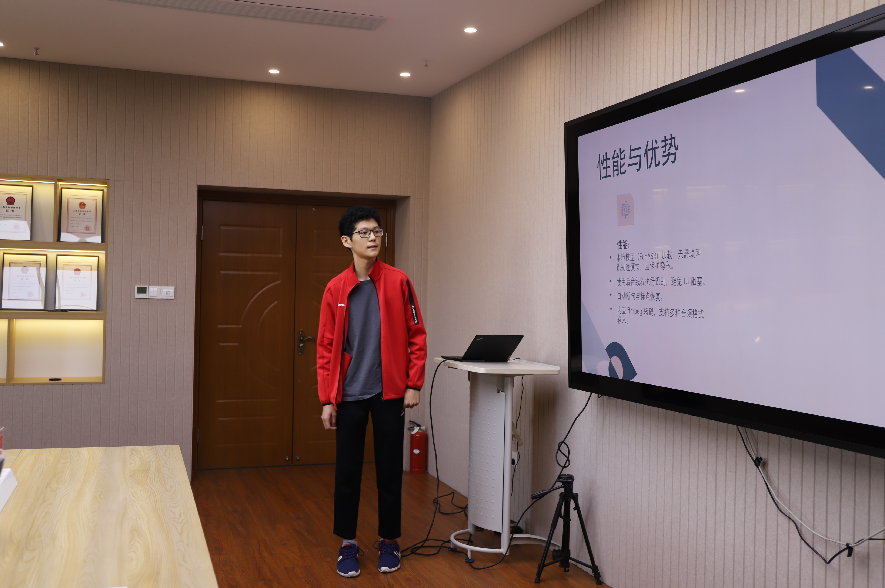

# Python中文语音识别

## 我在华东师范大学的答辩现场



一个简单的中文语音识别和多格式字幕生成桌面工具，基于 FunASR。

## 功能

- 支持中文识别模型 `paraformer-zh`
- 可生成 SRT、VTT、ASS、TXT 格式字幕
- 使用简单的 Tkinter 图形界面
- 支持 WAV、MP3、PCM 格式音频文件

## 运行环境

- Python 3.7 及以上
- 已安装 FFmpeg 并可在命令行中访问
- 必须的 Python 库：
  - funasr
  - modelscope
  - ffmpeg-python
  - tkinter

## 安装

创建虚拟环境并安装库（例如anaconda）：
```bash
conda create -n funasr python=3.12

conda activate funasr 

conda install pytorch==2.3.1 torchvision==0.18.1 torchaudio==2.3.1 pytorch-cuda=11.8 -c pytorch -c nvidia # 漫长等待

pip install -U funasr # 等待

pip install -U modelscope huggingface_hub # 等待

pip install -U ffmpeg-python # 等待
```


## 使用说明

1. 运行 Python 脚本：

```bash
python main.py
```
2. 使用界面选择音频文件并选择输出字幕格式。

3. 点击“开始识别并生成字幕”，等待字幕文件生成。

# ASR Chinese Python Tool

A simple desktop tool for Chinese speech recognition and multi-format subtitle generation using FunASR.

## Features

- Supports Chinese ASR model `paraformer-zh`
- Generates subtitles in SRT, VTT, ASS, and TXT formats
- Simple Tkinter GUI for easy usage
- Audio file format support: WAV, MP3, PCM

## Requirements

- Python 3.7+
- FFmpeg installed and accessible from command line
- Required Python packages:
  - funasr
  - modelscope
  - ffmpeg-python
  - tkinter

## Installation

Creating an environment and install packages(anaconda for example):
```bash
conda create -n funasr python=3.12

conda activate funasr 

conda install pytorch==2.3.1 torchvision==0.18.1 torchaudio==2.3.1 pytorch-cuda=11.8 -c pytorch -c nvidia # waiting (for a long time...)

pip install -U funasr # waiting

pip install -U modelscope huggingface_hub # waiting

pip install -U ffmpeg-python # waiting
```

## Usage

1. Run the Python script:

```bash
python main.py
```
2. Use the GUI to select an audio file and choose the output subtitle format.

3. Click "Start Recognition and Generate Subtitles" and wait for the subtitle file to be generated.
